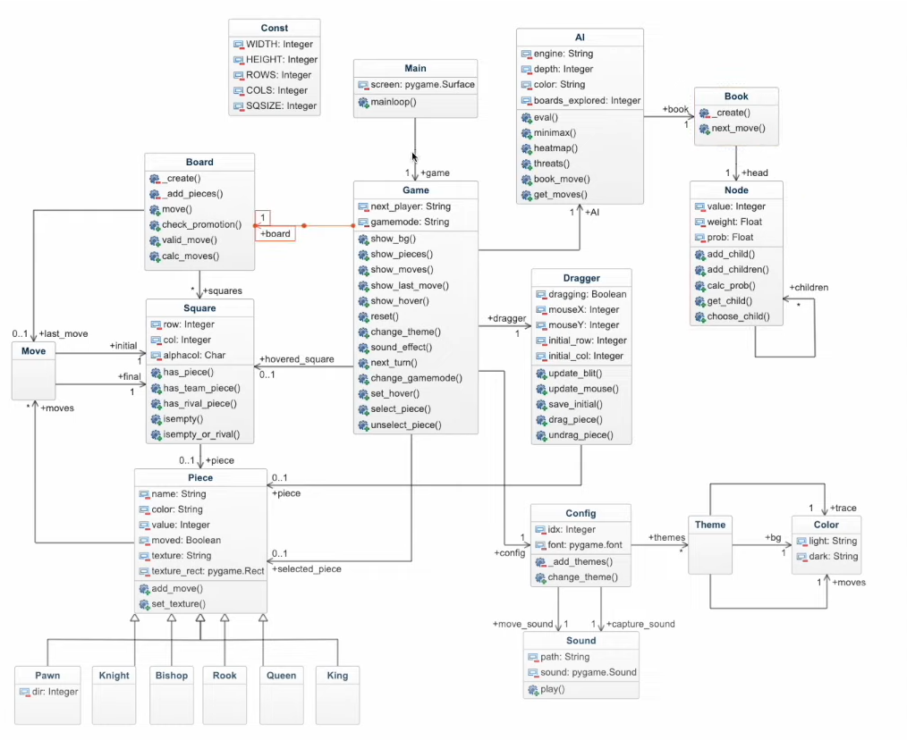

# 📒Classes

> Ce fichier contient et explique les classes et la structure du code.
>
> Référez vous à l'image suivante :

## ▶️ Const

Ce fichier contiendra les différentes constantes parmis lesquels : 

* `WIDTH`  : la largeur de la fenêtre;
* `HEIGHT` : la longueur de la fenêtre;
* `ROWS` : le nombre de lignes du plateau (qui sera de 8);
* `COLS` : les colonnes du plateau (qui sera de 8);
* `SQSIZE` : la taille du plateau, qui sera égale soit à `width/cols` sois par `height/rows`

## ▶️ Main 

La classe `Main` continent principalement: 

- L'attribut `SCREEN`
- La méthode `MAINLOOP` qui va globalement appeler toutes les autres classes 

Ainsi, la classe `Main` va avoir une référence à la classe `Game`

## ▶️ Game 

La classe `Game` va contenir principalement : 

- L'attribut `next_player` qui va contenir la couleur du prochain joueur (noir ou blanc );
- L'attibut `gamemode` qui va contenir le mode de jeu (PVP ou AI);
- Les méthodes de rendu comme `show_bg` (affichage de l'arrière plan ), `show_pieces` (affichage des pièces ), `show_moves` (affichage des mouvements), `show_last_move` (affichage du dernier mouvement) ou `show_hover` (affichage au survol ?);
- Une fonction `reset` de réinitialisation;
- Une fonction `change_theme` pour changer de thème (principalement un changement d'arrière plan);
- Une fonction qui gère les effets sonore : `sound_effect`;
- L'effet `next_turn`;
- La fonction `change_gamemode` pour passer du mode PVP vers AI et inversement;
- La fonction `set_hover` qui permettra de régler les effets au survol; 
- La fonction `select_piece` va gérer la sélection de la pièce et `ùnselect_piece` lorsque la pièce est désélectionner.

Cette classe `Game` va avoir beaucoup de références, avec presque toutes les classes à venir. 

## ▶️ Board 

Le jeu d'échec a bien évidemment un plateau, gérer par la classe `Board`. 
Nous allons avoir deux méthodes privés qui vont créer le plateau (`create`) et ajouter les pièces (`add_pieces`). 
Il va y avoir d'autres méthodes : 

- `move` qui va gérer les déplacements de la pièces et qui va donc être complexe;
- `check_promotion` qui va gérer la promotion d'une pièce d'échec (arrivée d'un pion au bout du plateau);
- `valid_move` qui va vérifier si un mouvement est valide;
- 
